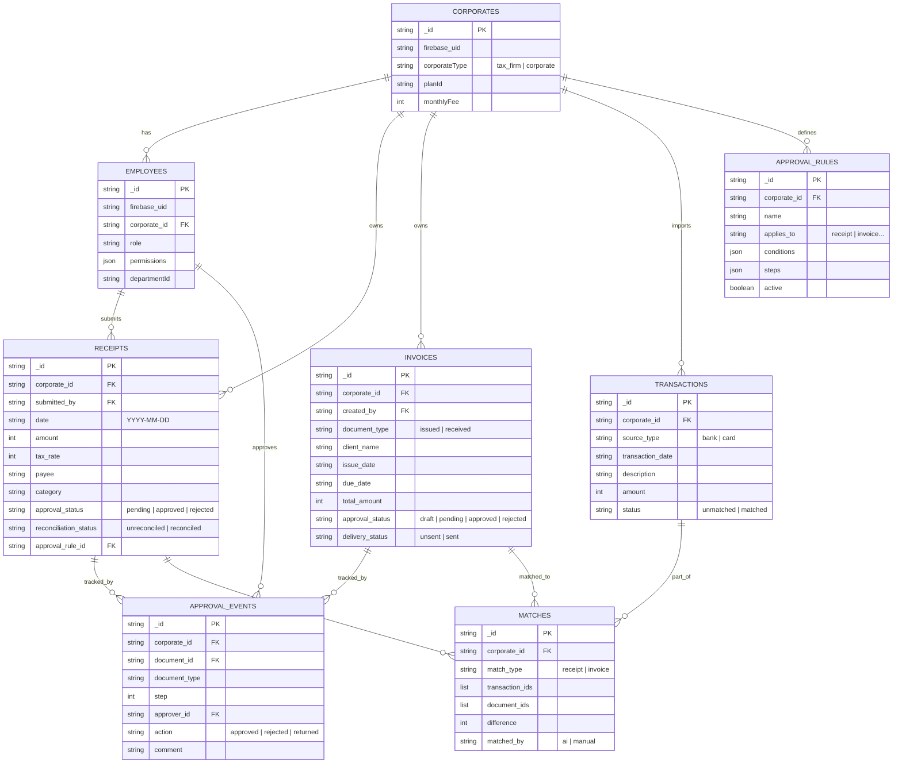
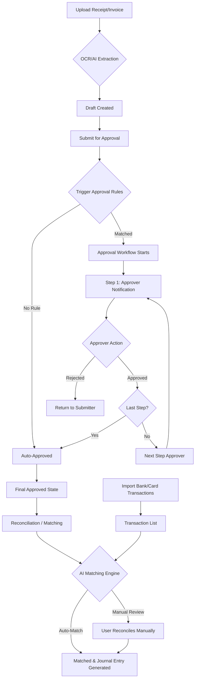
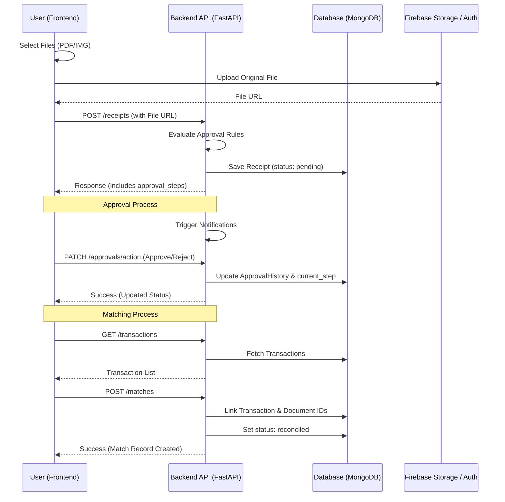

# Architecture Diagrams (Mermaid)

This document contains Mermaid diagrams that can be imported into draw.io.
To import into draw.io: `Arrange > Insert > Advanced > Mermaid...`

## 1. Database Schema (ER Diagram)

## 2. Process Map: Receipt/Invoice Approval to Reconciliation

## 3. API / UI Interaction Flow (Sequence Diagram)

